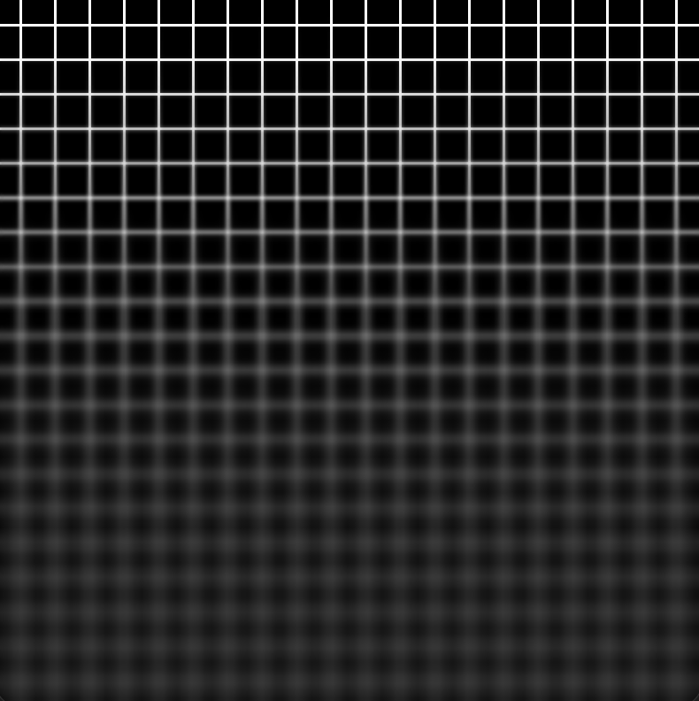
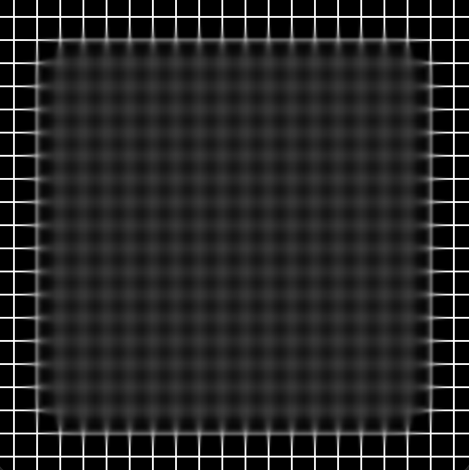
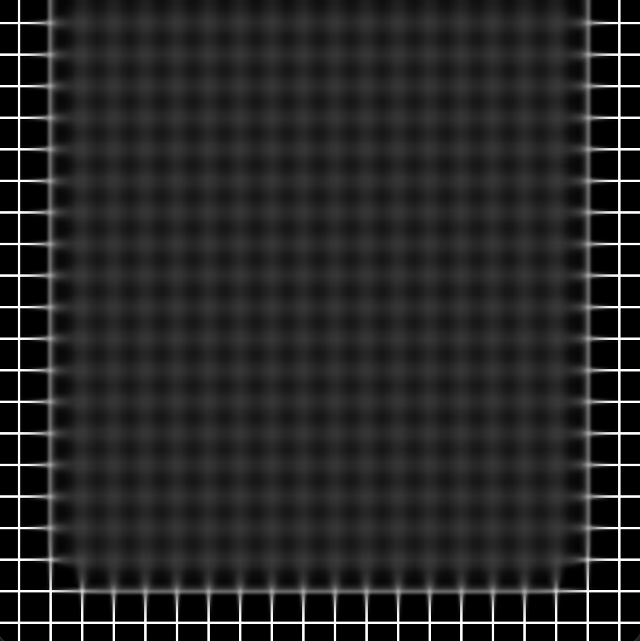
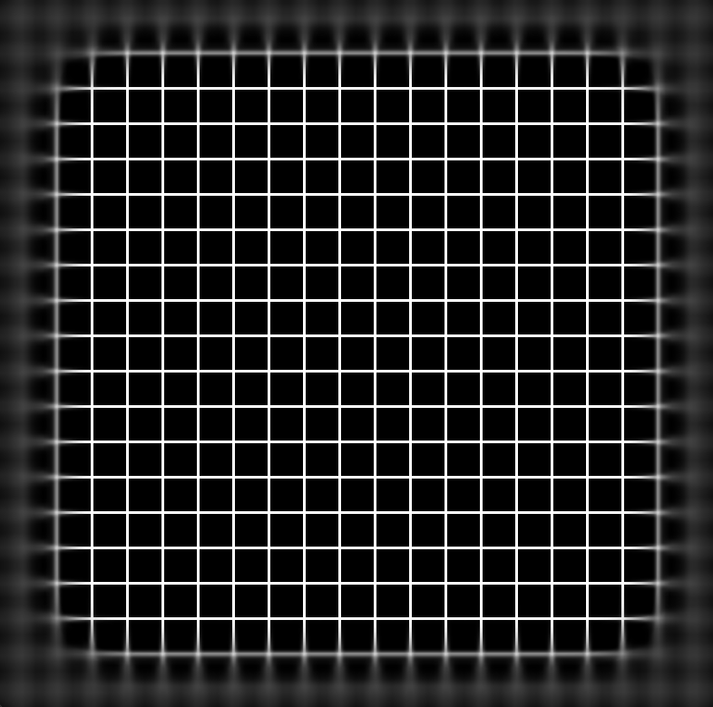
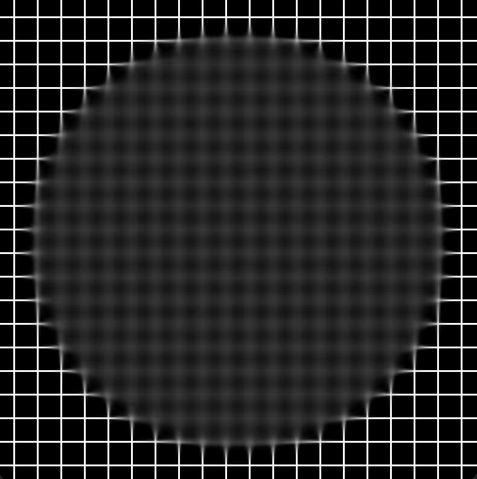
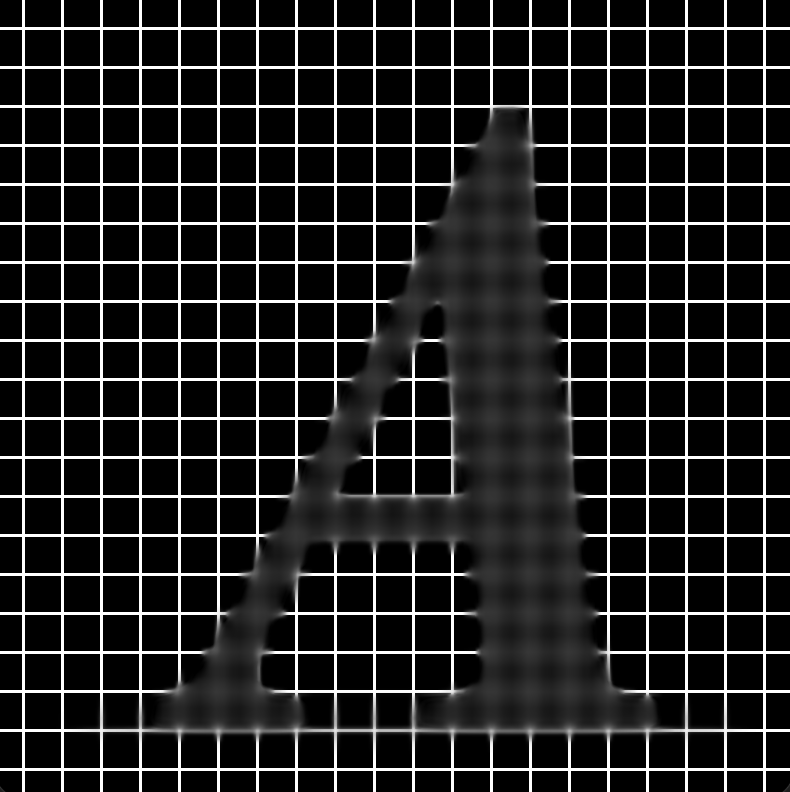

<div align="center">
  <h1><b>Haze</b></h1>
  <p>Master the power of dynamic blurring effects.<br>
</div>

Haze provides you with the ability to create fully custom variable blur effects in SwiftUI, UIKit and AppKit.
Powered by `CAFilter`, Haze is very performant.
What makes Haze unique is that it's fully customizable, as you'll see below.
Linear variable blurs are just the beginning when it comes to variable blur effects, so I hope you enjoy using this package as much as I have :)

## Installation

To add Haze to your Xcode project, you can use Swift Package Manager (SPM). Follow these steps:

1. Open your project in Xcode.
2. Go to `File` > `Swift Packages` > `Add Package Dependency...`.
3. Enter this URL: `https://github.com/MrKai77/Haze`
4. Select the version you want to use and add it to your project.

## Usage

The examples below focus on SwiftUI implementations, but equivalent UIKit/AppKit alternatives are available and actually power the SwiftUI views behind the scenes.
Haze internally uses masking to tell the underlying `CAFilter` exactly where to apply different blur intensities - from full blur to semi-blur to complete pass-through. 
Creating these masks from scratch can be complex, so Haze includes several ready-to-use presets to help you get started immediately:

### Linear Gradient Mask



```swift
SomeView()
    .overlay {
        HazeEffect(
            maskProvider: LinearGradientMaskProvider(
                startPoint: .top,
                endPoint: .bottom,
                startOpacity: 0.0,
                endOpacity: 1.0
            ),
            maxBlurRadius: 5
        )
    }
```

### Rounded Rectangle Mask



```swift
SomeView()
    .overlay {
        HazeEffect(
            maskProvider: RoundedRectangleMaskProvider(
                cornerRadius: 24,
                blurRadius: 10 // <- This blur radius affects the mask, not the variable blur effect
            ),
            maxBlurRadius: 5
        )
    }
```

You can choose which edges to feather/transition. For example, to blur everything except the top edge:



```swift
SomeView()
    .overlay {
        HazeEffect(
            maskProvider: RoundedRectangleMaskProvider(
                cornerRadius: 24,
                blurRadius: 10,
                featherEdges: [.bottom, .leading, .trailing] // <- Excludes the top, so it will be fully blurred.
            ),
            maxBlurRadius: 5
        )
    }
```

To blur the outer edges instead of the inside, invert the mask:



```swift
SomeView()
    .overlay {
        HazeEffect(
            maskProvider: RoundedRectangleMaskProvider(
                cornerRadius: 48,
                blurRadius: 12,
                invertAlpha: true // <- Sets the outer edges to blur out.
            ),
            maxBlurRadius: 5
        )
    }
```

### Elliptic Mask



```swift
SomeView()
    .overlay {
        HazeEffect(
            maskProvider: EllipticMaskProvider(
                blurRadius: 8
            ),
            maxBlurRadius: 5
        )
    }
```

### Image Mask



```swift
SomeView()
    .overlay {
        HazeEffect(
            maskProvider: ImageMaskProvider(
                image: UIImage(named: "Mask"), // <- This will be a UIImage on iOS, NSImage on macOS.
                contentMode: .fit
            ),
            maxBlurRadius: 5
        )
    }
```

By default, ImageMaskProvider uses the alpha channel of the image as the mask.
If you prefer to use a grayscale spectrum (e.g. a heightmap‑style mask), set: `useGrayscaleAsAlpha: true`.

### SwiftUI.Shape Mask

```swift
let maskBlurRadius: CGFloat = 10

SomeView()
    .overlay {
        HazeEffect(
            maskProvider: ShapeMaskProvider(
                shape: CustomShape(),
                blurRadius: maskBlurRadius
            ),
            maxBlurRadius: 5
        )
        .padding(-maskBlurRadius * 2)
    }
```

Be aware that the shape is automatically inset based on the `blurRadius` you pass to `ShapeMaskProvider`.
This prevents the blur from being clipped at the edges.
To counteract the inset, you should add negative padding to the HazeEffect, as shown above. 
The padding is multiplied by 2 because a Gaussian blur can extend slightly beyond the specified radius.

## License

Haze is released under **Apache-2.0 license** See the [LICENSE](LICENSE) file in the repository for the full license.
